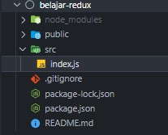
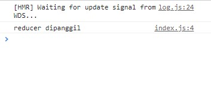
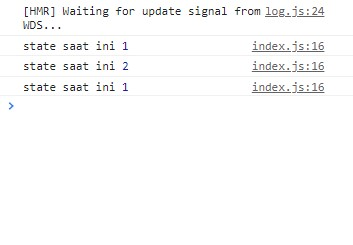

# Kenalan dengan Redux
Redux dapat membingungkan bagi pengembang React yang masih baru untuk memahami nya. Ada banyak kondsep yang perlu anda ketahui untuk menggunakan Redux dengan benar, seperti `reducer`, `action`, `store`, dan masih banyak lagi

Tapi setiap pengembang React harus mengetahui dasar-dasar bagaimana bekerja dengan Redux, karena proyek industri sering menggunakan Redux untuk mengelola proyek yang lebih besar.

Jadi di artikel ini, kita akan menjelajahi dasar-dasar Redux dan cara menggunakannya

## Bagaimana memulai dengan Redux
Mari kita buat terlebih dahulu project React untuk belajar menggunakan dasar dari Redux.

Jalankan perintah dibawah pada terminal kamu untuk membuat proyek React menggunakan `create-react-app`

```
npx create-react-app belajar-redux
```

> npx memungkinkan kita untuk menggunakan package npm create-react-app untuk membuat proyek React baru tanpa menginstallnya di mesin lokal kita.

Setelah kamu membuat proyek, hapus semua file dari folder src dan buat file baru index.js di dalam folder src sehingga struktur folder nya akan seperti ini 
<p style="text-align: center"></p>

Sekarang buka terminal lagi dan jalankan perintah berikut dari folder belajar-redux:

```javascript
npm install redux
```

<br />

## Cara Membuat Redux Store
Dalam Redux, kamu menggunakan `store` untuk mengelola dan melacak data yang berubah dalam aplikasi

Untuk membuat store, kita perlu mengimpor fungsi `createStore` seperti ini:

```javascript
import { createStore } from 'redux'
```

<br />

Fungsi `createStore` menerima 3 argumen:
* argumen pertama adalah fungsi yang biasanya dikenal sebagai `reducer` (wajib)
* argumen kedua adalah nilai awal dari state (opsional)
* argumen ketiga adalah `enhancer` di mana kita dapat mengisi middleware, jika ada (opsional)

Perhatikan kode dibawah ini:
```javascript
import { createStore } from 'redux'

const reducer = (state, action) => {
  console.log('reducer called')
  return state
}

const store = createStore(reducer, 0)
```

> Tanda ( ; ) opsional dalam JavaScript, kamu bebas menggunakan nya atau tidak 

<br />

Di sini, pertama-tama kita mendefinisikan fungsi reducer menggunakan sintaks [arrow function ES6](https://developer.mozilla.org/en-US/docs/Web/JavaScript/Reference/Functions/Arrow_functions). Anda dapat menggunakan fungsi normal alih-alih fungsi panah jika Anda mau.

Di dalam fungsi reducer, kita mencatat beberapa teks ke konsol dan kemudian mengembalikan nilai state dari fungsi tersebut.

Kemudian kita meneruskan fungsi reducer itu ke fungsi `createStore` sebagai argumen pertama dan 0 sebagai nilai awal state sebagai argumen kedua.

Fungsi `createStore` mengembalikan store yang dapat kita gunakan untuk mengelola data aplikasi. Fungsi reducer menerima state dan action sebagai parameter.

Nilai awal state yang kita lewati sebagai 0 untuk fungsi `createStore` secara otomatis diteruskan sebagai nilai parameter state

Tapi itu adalah praktek yang jauh lebih umum untuk menginisialisasi keadaan di dalam reducer itu sendiri daripada meneruskan sebagai argumen kedua ke fungsi createStore seperti ini:

```javascript
import { createStore } from 'redux'

const reducer = (state = 0, action) => {
  console.log('reducer called')
  return state
}

const store = createStore(reducer)
```

<br />

Di sini kita menggunakan sintaks parameter default ES6 untuk menginisialisasi parameter state ke nilai 0.

Setelah state dibuat, kita dapat menggunakan metode `subscribe` yang disediakan oleh state untuk berlangganan perubahan di state seperti yang diperlihatkan dibawah:

```javascript
store.subscribe(() => {
  console.log('current state', store.getState())
})
```

<br />

Di sini, menggunakan fungsi `subscribe`, kita mendaftarkan fungsi `callback` yang akan dipanggil setelah store diubah.

Dan di dalam fungsi `callback`, kita memanggil metode `store.getState` untuk mendapatkan nilai state saat ini.

Sekarang, coba buka file src/index.js dan tambahkan kode ini di dalamnya:

```javascript
import { createStore } from 'redux'

const reducer = (state = 0, action) => {
  console.log('reducer dipanggil')
  return state
}

const store = createStore(reducer)

store.subscribe(() => {
  console.log('state saat ini', store.getState())
})
```

Sekarang, jika kamu menjalankan aplikasi dengan menjalankan perintah `npm start` dari terminal dan mengakses http://localhost:3000/, kamu akan melihat pesan `reducer dipanggil` tercetak di konsol.

<p style="text-align: center"></p>

Ini terjadi karena reducer dipanggil setelah kita meneruskan fungsi `createStore`

## Cara mengubah Store
Sekarang kita sudah selesai membuat store. Tapi store kelihatan belum berguna banyak buat kita. Ini karena store terhubung menggunakan fungsi reducer, tapi kita belum menambahkan kode apa pun di dalam reducer untuk mengelola store. Jadi mari kita lakukan itu

Satu-satunya cara untuk mengubah store adalah dengan mengirimkan `action`, `action` adalah objek yang dikirim ke store seperti ini:

```javascript
store.dispatch({
  type: 'INCREMENT'
})
```

Di sini, kita memanggil fungsi `dispatch` yang tersedia di store untuk mengirim action dengan tipe INCREMENT ke store.

Fungsi `dispatch` mengambil objek sebagai parameter yang dikenal sebagai action.

action harus memiliki properti tipe seperti yang ditunjukkan di atas. Jika kamu tidak mengisi properti tipe maka kamu akan mendapatkan error

> Merupakan suatu hal yang umum dan disarankan untuk menentukan nilai tipe dalam huruf besar 

Tipe nya dapat berupa operasi apa pun yang ingin kamu lakukan, serperti `AUTH_SUCCESS`, `AUTH_ERROR`, `LOGIN_SUCCESS`, `LOGOUT`, `ADD_USER` dan banyak lagi.

Jika kamu memiliki beberapa kata, kamu dapat memisahkannya dengan garis bawah seperti ini `{ type: 'INCREMENT_NUMBER' }`.

Sekarang, buka file index.js dan ganti isinya dengan kode berikut:

```javascript
import { createStore } from 'redux'

const reducer = (state = 0, action) => {
  if (action.type === 'INCREMENT') {
    return state + 1
  } else if (action.type === 'DECREMENT') {
    return state - 1
  }

  return state
}

const store = createStore(reducer)

store.subscribe(() => {
  console.log('state saat ini', store.getState())
})

store.dispatch({
  type: 'INCREMENT'
})

store.dispatch({
  type: 'INCREMENT'
})

store.dispatch({
  type: 'DECREMENT'
})
```

<br />

Sekarang jika kamu menjalankan aplikasi dengan menjalankan perintah `npm start` dari terminal, kamu akan melihat log berikut dicetak di konsol:
<p style="text-align: center"></p>

Seperti yang kamu lihat, untuk setiap action yang dikirim ke store, store akan berubah. Jadi kita bisa melihat nilai yang berbeda dari keadaan di konsol.

Dalam kode di atas, fungsi reducer kita terlihat seperti ini:
```javascript
const reducer = (state = 0, action) => {
  if (action.type === 'INCREMENT') {
    return state + 1
  } else if (action.type === 'DECREMENT') {
    return state - 1
  }

  return state
}
```

<br />

Setiap kali kita memanggil fungsi `store.dispatch`, fungsi reducer akan dipanggil. Apa pun yang dikembalikan dari reducer akan menjadi nilai baru di store.

Jadi pertama kali kita mengirimkan action ke store seperti ini:
```javascript
store.dispatch({
  type: 'INCREMENT'
})
```

<br />

Yang pertama jika kondisi di dalam fungsi reducer akan dieksekusi. Ini akan menambah nilai state ke 1 yang awalnya diinisialisasi ke 0 menggunakan sintaks parameter default ES6. Kemudian akan dikembalikan dari fungsi reducer.

**Perhatikan bahwa kita menggunakan nilai state untuk menghitung nilai baru dan kita tidak mengubah nilai state asli seperti ini:**

```javascript
if (action.type === 'INCREMENT') {
   state = state + 1;
   return state;
} 
```

<br />

Jadi kode di atas tidak benar, karena di reducer kita tidak boleh mengubah keadaan aslinya. Melakukan hal tersbut hanya akan membuat masalah dalam aplikasi kita sehingga tidak disarankan.

Dan karena kita telah menambahkan fungsi `store.subscribe` di file index.js, kita mendapat pemberitahuan tentang store yang berubah dengan kita dapat melihat log di konsol.

Jadi ketika kita memanggil lagi dispatch dengan tipe INCREMENT, kondisi if pertama akan dieksekusi kembali. Jadi itu akan menambahkan 1 ke nilai state sebelumnya yaitu 1, dan nilai state akhir akan menjadi 2.

Kemudian kita mengirimkan action DECREMENT ke store seperti ini

```javascript
store.dispatch({
  type: 'DECREMENT'
})
```

<br />

Kode diatas akan mengeksekusi kondisi else if di dalam reducer dan akan mengurangi nilai state sebesar 1 (jadi 2 - 1 akan menjadi 1).

Perhatikan bahwa di dalam reducer, kita juga mengembalikan state di akhir. Jadi jika tidak ada kondisi yang cocok, state default sebelumnya akan dikembalikan dari fungsi.

Oke, dari kode diatas sepertinya sudah keliatan sempurna. Tapi kalau kalian perhatikan kita menggunakan if..else padahal yang kita ingin kondisi kan hanya nilai dari action.type. 

Cara paling umum dalam melakukan pengkondisian pada action.type dengan menggunakan pernyataan switch di dalam reducer daripada menggunakan kondisi if..else. Seperti ini kode nya:

```javascript
const reducer = (state = 0, action) => {
  switch (action.type) {
    case 'INCREMENT':
      return state + 1
    case 'DECREMENT':
      return state - 1
    default:
      return state
  }
}
```

<br />

Selain tipe, kita juga dapat menyampaikan informasi tambahan sebagai bagian dari action.

Ganti isi file index.js dengan kode berikut:
```javascript
import { createStore } from 'redux';

const reducer = (state = 0, action) => {
  switch (action.type) {
    case 'INCREMENT':
      return state + action.payload;
    case 'DECREMENT':
      return state - action.payload;
    default:
      return state;
  }
};

const store = createStore(reducer);

store.subscribe(() => {
  console.log('state saat ini', store.getState())
})

store.dispatch({
  type: 'INCREMENT',
  payload: 1
})

store.dispatch({
  type: 'INCREMENT',
  payload: 5
})

store.dispatch({
  type: 'DECREMENT',
  payload: 2
})
```

<br />

Sekarang jika kamu menjalankan aplikasi dengan menjalankan perintah `npm start` dari terminal, kamu akan melihat log berikut dicetak di konsol:

<p style="text-align: center"></p>

Di sini, saat mengirimkan action ke store, kita memasukkan `payload` dengan beberapa nilai yang kita gunakan di dalam reducer untuk menambah atau mengurangi nilai store.

Di sini, kita telah menggunakan payload sebagai nama properti tapi sebenarnya kamu dapat memberi nama apa pun yang kamu inginkan. Tapi disarankan selalu menggunakan nama yang umum agar tidak mempersulit yang lain untuk membaca kode kamu.

Fungsi reducer kita sekarang seperti ini:
```javascript
const reducer = (state = 0, action) => {
  switch (action.type) {
    case 'INCREMENT':
      return state + action.payload
    case 'DECREMENT':
      return state - action.payload
    default:
      return state
  }
}
```

<br />

Jadi ketika kita mengirimkan action dengan jenis `INCREMENT` seperti ini:
```javascript
store.dispatch({
  type: 'INCREMENT',
  payload: 1
})

store.dispatch({
  type: 'INCREMENT',
  payload: 5
})
```

<br />

kode berikut dari reducer akan dieksekusi:
```javascript
return state + action.payload;
```

Ini pertama-tama akan menambahkan 1 dan kemudian 5 ke nilai state sebelumnya, jadi kita beralih dari 1 ke 6. Dan karena jenis action DECREMENT:

```javascript
store.dispatch({
  type: 'DECREMENT',
  payload: 2
});
```

<br />

Store kita yang awalnya 6 sekarang menjadi 4. Jadi nilai akhir store akan menjadi 4.

## Kesimpulan
Apa yang sudah kita pelajari tadi?

* Kenalan dengan reducer, action, dan store
* Cara membuat store dan reducer
* Cara mengirim action ke store dan mengelola action
* Cara mendapatkan informasi state saat ini

For your information, Dalam react ada namanya `createContext`. Jadi by default react juga bisa mengelola state, hanya Redux muncul untuk mempermudah dalam mengelola state dan membuat kode kita sedikit lebih bersih dan rapi. 

Itu saja artikel kali ini, kalian bisa explore lebih tentang [Redux](http://redux.js.org/) atau mau mencoba `createContext` pada [React](https://reactjs.org/docs/context.html)